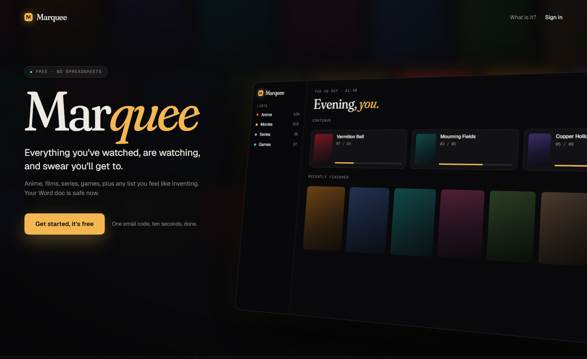
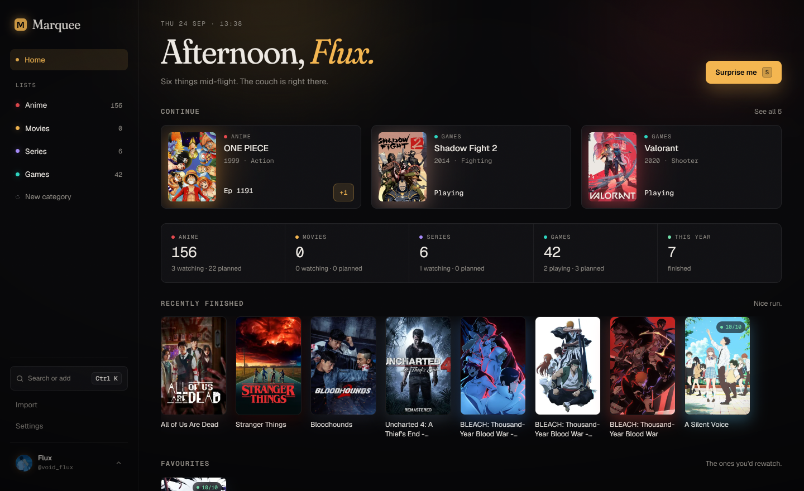
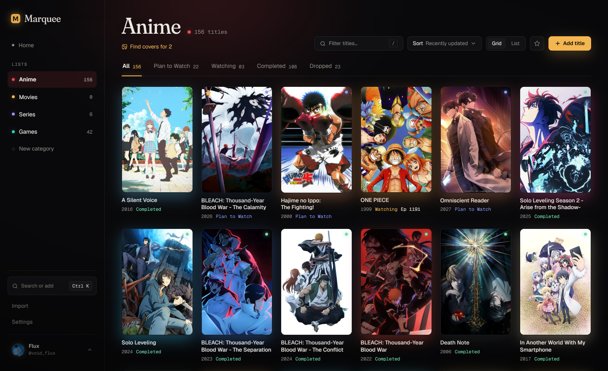

# Marquee

A cinematic media tracker for anime, films, series, games, and any shelf you want to define.

**[getmarquee.vercel.app](https://getmarquee.vercel.app)**

Marquee replaces the notes app, the spreadsheet and the half finished Word document with a single library that looks like it was designed on purpose. It is multi user and private by default: every row is protected by Postgres row level security, so no account can read another account's library.

Built with Next.js 16, React 19 Server Components and Server Actions, Tailwind CSS v4 and Supabase. TypeScript throughout, strict, with no `any`.

---

**Landing.** The public face, and the only screen you see before signing in.



**Home.** What you are partway through, what each shelf holds, and what you finished lately.



**A shelf.** Status tabs with counts, filter and sort, and a wall of 2:3 poster art.



---

## Contents

- [Features](#features)
- [Architecture](#architecture)
- [Tech stack](#tech-stack)
- [Getting started](#getting-started)
- [Scripts](#scripts)
- [Project structure](#project-structure)
- [Design system](#design-system)
- [Keyboard shortcuts](#keyboard-shortcuts)
- [Security and privacy](#security-and-privacy)
- [Testing and accessibility](#testing-and-accessibility)
- [Attribution](#attribution)
- [License](#license)

---

## Features

### Library

Shelves are typed. An anime shelf says "Plan to Watch" and counts episodes, a games shelf says "Backlog" and says "Playing", a films shelf says "Watchlist" and "Watched". Status wording lives in one module, never hard coded in a component, so a new shelf kind is a data change rather than a search and replace.

Progress steps from the shelf or from Home without opening anything. Ratings are out of 10, notes are freeform, favourites are one tap, and start and finish dates are stamped by a database trigger rather than by the client.

### Metadata

Titles are searched as you type against TMDB for films and series, AniList for anime, and IGDB for games. A match brings back the cover, release year, episode count, genres, community score, runtime and format, plus the dominant colour of the artwork, which becomes that title's accent throughout the interface.

Provider keys never reach the browser. All three are called from a single server route. If a key is absent the search returns empty and the interface offers manual entry instead of failing.

### Import and matching

Existing lists come in from pasted text or from `.docx`, `.md`, `.csv`, `.tsv`, `.xlsx`, `.json`, `.html` and MyAnimeList `.xml`. Everything is parsed, deduplicated against what is already on the shelf and shown for review before a single row is written.

Imported titles arrive as plain text. **Find covers** then matches them in bulk: fuzzy title scoring, a candidate picker for anything ambiguous, and franchise traversal that offers the rest of a series when it finds one season.

### Year in review

`/wrapped` is a scroll snapped reel of six frames covering what arrived, what was finished, screen time, genre shares and the year's best rated title, with the whole reel tinted by that title's cover. It exports as a shareable PNG rendered server side with Satori.

It is careful about what it claims. Two clocks are kept apart: `created_at` is true for everyone, while `finished_at` only exists for titles completed inside the app, so an imported library's undated completions get a line of their own rather than being counted as this year's. Screen time uses real runtimes where a provider supplied one and falls back to documented per format estimates where it did not.

### Interface

A command palette on `Ctrl+K` searches every title, jumps between shelves and runs global actions. **Surprise me** spins a marquee reel and picks a random planned title. Completing something stamps an ADMIT ONE ticket, with haptics on phones that support it.

The layout is responsive from 360px upward, with bottom sheets and a bottom navigation bar on phones, and it installs as a PWA.

### Portability

Export the whole library as JSON or a single shelf as RFC 4180 CSV, at any time, from Settings. Deleting an account purges the profile, the uploaded avatar, every category and every item through a cascading database function, not through a best effort client loop.

---

## Architecture

```
Browser
  React Server Components, with client islands only where there is interaction
      |
      |-- Server Components ....... direct Postgres reads through the Supabase server client,
      |                             scoped by row level security
      |-- Server Actions .......... mutations validated with Zod, then revalidatePath,
      |                             with useOptimistic for status, progress and favourites
      |-- Route Handlers
      |     /api/search ........... proxied search to TMDB, AniList and IGDB, server cached
      |     /api/titles ........... lightweight title index for the command palette
      |-- /wrapped/ticket ......... year in review PNG, rendered with next/og and Satori

Supabase
  Auth ........................... Google OAuth and six digit email codes, with an
                                   invisible Cloudflare Turnstile check on the form
  Postgres ....................... profiles, categories, items, every table behind RLS
  Storage ........................ avatars, cropped and converted to WebP in the browser
  Triggers and functions ......... default shelves on signup, status date stamping,
                                   batch import, account deletion, runtime backfill

proxy.ts
  Session refresh, route guarding, and a per request Content Security Policy nonce
```

Reads happen in Server Components. Writes happen in Server Actions under `lib/actions`, each one validating its input with Zod and re-checking the session, because the proxy is a convenience and not the security boundary. The service role key is never used in application code.

URL is state. The active shelf tab, view mode, sort order and open item all live in search params, so every view is linkable and the back button behaves.

---

## Tech stack

| Layer | Choice |
|---|---|
| Framework | Next.js 16.3.5, App Router, Turbopack, React 19.2.8 |
| Language | TypeScript, strict |
| Styling | Tailwind CSS v4, design tokens declared with `@theme` in `globals.css` |
| Components | Radix UI primitives, `cmdk`, `sonner`, custom primitives in `components/ui` |
| Motion | Motion for React, with `prefers-reduced-motion` respected throughout |
| Icons | Lucide |
| Database, auth, storage | Supabase, Postgres with row level security, `@supabase/ssr` |
| Metadata | TMDB REST, AniList GraphQL, IGDB via Twitch OAuth |
| Validation | Zod v4 |
| Drag and drop | dnd kit, for reordering shelves |
| File parsing | Mammoth for `.docx`, JSZip for `.xlsx` and `.zip` |
| Image generation | `next/og` and Satori |
| Bot protection | Cloudflare Turnstile, invisible mode |
| Testing | Vitest, Testing Library, Playwright |
| Hosting | Vercel |

---

## Getting started

### Prerequisites

- Node.js 20 or newer
- pnpm 12 or newer
- A Supabase project, for Postgres, Auth and Storage

### 1. Install

```bash
git clone https://github.com/KarthikAkshaj/Marquee.git
cd Marquee
pnpm install
```

### 2. Configure

```bash
cp .env.example .env.local
```

| Variable | Required | Purpose |
|---|---|---|
| `NEXT_PUBLIC_SUPABASE_URL` | Yes | Supabase project URL |
| `NEXT_PUBLIC_SUPABASE_PUBLISHABLE_KEY` | Yes | Publishable (anon) key |
| `NEXT_PUBLIC_SITE_URL` | Yes | Origin used to build auth redirects |
| `SUPABASE_PROJECT_ID` | For `db:types` | Project ref, used to generate database types |
| `TMDB_READ_TOKEN` | For films and series | TMDB read access token |
| `TWITCH_CLIENT_ID` | For games | IGDB is authenticated through Twitch |
| `TWITCH_CLIENT_SECRET` | For games | As above |
| `NEXT_PUBLIC_TURNSTILE_SITE_KEY` | Optional | Enables the sign-in captcha. The secret goes in the Supabase dashboard, not here |

Missing provider keys are handled rather than fatal. A provider without a key returns no results and the interface offers manual entry. Without a Turnstile site key there is no widget and no token, which is how local development and the test suite run.

### 3. Set up the database

Run the files in `supabase/migrations/` against your project, in order:

| File | Contents |
|---|---|
| `0001_init.sql` | Enums, profiles, categories, items, triggers, RLS policies |
| `0002_avatars.sql` | Avatar storage bucket and its policies |
| `0003_username_available.sql` | Username availability function |
| `0004_item_metadata.sql` | Genres and community score |
| `0005_import_titles.sql` | Batch import, with status date stamping suppressed |
| `0006_item_runtime.sql` | Runtime and format columns |
| `0007_fill_item_runtimes.sql` | Runtime backfill, with the updated_at trigger suppressed |

Then generate types from the live schema:

```bash
pnpm db:types
```

`lib/supabase/database.types.ts` is generated. It is never edited by hand.

### 4. Run

```bash
pnpm dev
```

The app is at http://localhost:3000.

---

## Scripts

| Command | Description |
|---|---|
| `pnpm dev` | Development server with Turbopack |
| `pnpm build` | Production build |
| `pnpm start` | Serve the production build |
| `pnpm lint` | ESLint |
| `pnpm typecheck` | Next.js type generation, then `tsc --noEmit` |
| `pnpm test` | Vitest, single run |
| `pnpm test:watch` | Vitest, watch mode |
| `pnpm test:e2e` | Playwright, desktop and mobile projects |
| `pnpm db:types` | Regenerate database types from Supabase |

---

## Project structure

```
app/
  (app)/                  Authenticated shell
    c/[slug]/             Shelf views: grid, list, find covers
    home/                 Continue watching, shelf stats, recents
    import/               Import wizard
    settings/             Profile, categories, data, account
  (marketing)/            Landing page, privacy, terms
  api/
    search/               The only place provider APIs are called
    titles/               Title index for the command palette
  auth/callback/          OAuth and email code callback
  login/                  Sign in
  wrapped/                Year in review, and its PNG route
  globals.css             Design tokens, grain, keyframes
  manifest.ts             PWA manifest
  error.tsx               Boundary above the app layout

components/
  add/ auth/ category/ fun/ home/ import/ items/ marketing/
  match/ palette/ settings/ shell/ ui/ user/ wrapped/

lib/
  actions/                Server actions, one module per concern
  import/                 Parsers for each supported file type
  search/                 TMDB, AniList and IGDB clients, and their normalisers
  supabase/               Browser, server and proxy client factories
  items.ts                Progress and status transitions, kept pure
  status.ts               Status wording per shelf kind. The only source
  wrapped.ts              Year in review aggregation, kept pure
  security.ts             Content Security Policy construction
  validators.ts           Zod schemas for every action and route

supabase/migrations/      Schema, RLS policies, triggers, functions
e2e/                      Playwright specs
proxy.ts                  Session refresh, route guarding, security headers
```

Two rules keep this navigable. Anything with interesting logic is pulled into `lib` as a pure function so it can be tested without a browser or a database. Components stay under roughly 150 lines and are extracted when they grow past it.

---

## Design system

The visual language is Cinematic Dark. Tokens are declared once in `app/globals.css` and referenced by name. No raw hex in components, and no default framework greys.

**Surfaces**

| Token | Value | Use |
|---|---|---|
| `bg` | `#09090B` | Page background |
| `surface` | `#111114` | Cards and panels |
| `elevated` | `#18181C` | Raised layers, sheets |
| `text` | `#EDE9E3` | Primary text |
| `accent` | `#F4B650` | Marquee amber, the single accent |

Shelf kinds carry their own accents: crimson for anime, amber for films, violet for series, teal for games, plus sky, rose, lime and sand for custom shelves. Individual titles override the accent with the dominant colour extracted from their cover art, so a shelf takes on the colour of what is actually on it.

**Type**

Fraunces for display, at 28px and above only. Geist for interface text. Geist Mono for anything numeric: progress, ratings, dates, counts and keyboard hints.

**Detail**

A film grain overlay generated from inline SVG turbulence, ambient glows behind the fold, a one pixel inner highlight on raised surfaces, and 2:3 posters at a 10px radius. Titles without artwork get a generated cover rather than a broken image. Motion runs on a single easing curve between 150 and 350ms, and every animation has a reduced motion path.

---

## Keyboard shortcuts

| Keys | Action |
|---|---|
| `Ctrl+K` or `Cmd+K` | Command palette: search titles, jump to shelves, add |
| `S` | Surprise me, pick a random planned title |
| `N` | Add a title to the current shelf |
| `/` | Focus the filter on a shelf |
| `Esc` | Close the active sheet, dialog or palette |

Single key shortcuts are suppressed while a dialog is open or while typing into a field.

---

## Security and privacy

**Row level security on every table.** Policies are written alongside the schema in the same migration. The Supabase service role key is never used in application code, so there is no path that bypasses those policies. Every server action re-checks the session rather than trusting the proxy.

**Content Security Policy per request.** `lib/security.ts` builds the policy and `proxy.ts` applies it. Pages rendered per request receive a fresh nonce and `script-src 'self' 'nonce-...' 'strict-dynamic'`. Prerendered pages have no nonce to receive and fall back to a stricter host allowlist. Both refuse framing, foreign origins, plugins and a rewritten base URI. Entry into the authenticated area goes through a full document load so the nonce policy actually applies rather than being inherited from a prerendered page.

**Transport and headers.** HSTS for two years including subdomains, `nosniff`, `X-Frame-Options: DENY`, a strict origin referrer policy, and a Permissions Policy that disables camera, microphone, geolocation, payment and USB. `upgrade-insecure-requests` is production only.

**Sign in.** Google OAuth, or a six digit code by email. The form carries an invisible Cloudflare Turnstile token, verified by Supabase rather than by application code. A fresh token is issued for every send, including resends.

**Provider keys stay server side.** TMDB, AniList and IGDB are reached only from `app/api/search`. No provider credential is ever included in a client bundle.

---

## Testing and accessibility

Unit and integration tests run under Vitest, covering the pure modules directly: status and progress transitions, import parsers for every supported format, fuzzy matching, the year in review aggregation, export shaping, and the server actions against a mocked Supabase client. Component tests use Testing Library. Playwright covers end to end journeys against a production build, on desktop and mobile viewports, including the security headers themselves.

Accessibility is audited rather than assumed. As of the 2026-09-19 audit, Lighthouse 13.5 scored **100 for accessibility on all 13 screens**, mobile and desktop, against a production build. axe 4.13 was **clean for WCAG 2.2 AA** with dialogs open, covering the title sheet, add panel, command palette, Surprise me, the match picker, the category dialog and account deletion.

The standing rules behind those numbers: everything reachable by keyboard, a visible focus ring, labelled icon buttons, AA contrast, and status never communicated by colour alone.

---

## Attribution

- Film and television metadata and artwork from [The Movie Database](https://www.themoviedb.org/). This product uses the TMDB API but is not endorsed or certified by TMDB.
- Anime metadata from [AniList](https://anilist.co/).
- Game metadata from [IGDB](https://www.igdb.com/).
- Geist and Geist Mono by Vercel, under the SIL Open Font License.
- Fraunces by Undercase Type, under the SIL Open Font License.

---

## License

All rights reserved. This repository is public for reference and is not licensed for reuse or redistribution.
